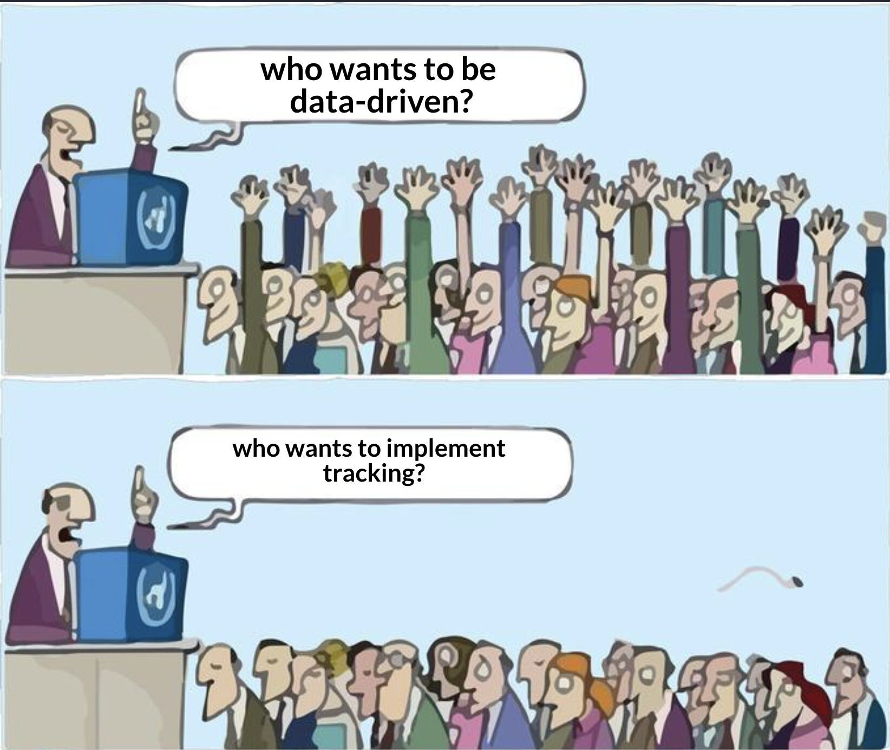
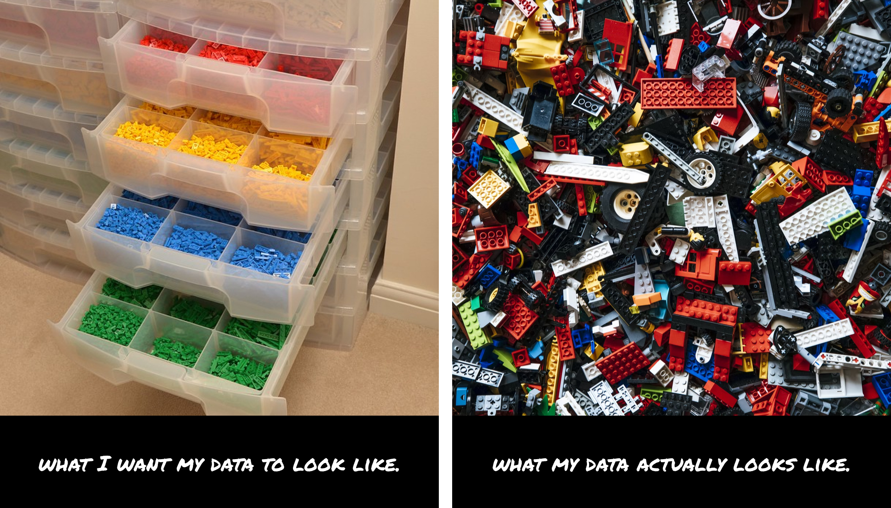

import VideoPlayer from '@site/src/components/video-player'
import EmbedTweet from '@site/src/components/embed-tweet'

*During the last 12 months, our team of ten has silently worked on an open-source project that aims to effectively integrate data science into the product analytics workflow. In this series of blog posts, we want to take you along our journey and show you what we’ve been working on.*

<!--truncate-->

 

For a few years, we’ve had the privilege to look inside the kitchens of many product analytics teams to see how they were organized, how they worked and what they struggled with.

We saw [an increasing amount of people with a data science role](https://www.zdnet.com/article/employers-are-desperate-for-data-scientists-as-demand-booms/) joining these teams, which isn’t too surprising with the rise of companies that have adopted a data-driven approach.

What we also saw: Front-end engineers that had to implement yet another tracking plan because data science was missing events. Data scientists jokingly calling themselves data janitors because of all the gruntwork they needed to do. Data engineers rebuilding the models of data scientists in order to use them for production. And product owners confused with the amount of time it took to answer seemingly simple product questions.

They were also all doing the same thing: building models for retention, attribution, user segmentation, churn prediction and such. And all of it was done from scratch.

Product analytics platforms today are simply not designed with data science in mind.

 

***So, what's the problem?*** 

Well, we believe there's a couple.

## Current analytics trackers collect data that’s not great for modeling

There is a big gap between what data scientists want their data to look like for modeling and what data actually looks like when it comes from the tracker. 

While most trackers simply track everything by inserting a simple script, the data they collect often contains errors, such as missing or duplicate events. It is also unstructured and ambiguous, making it hard to identify what event you're looking at without having the UI and source code on hand. 

Significant gruntwork is typically required before it can be used for modeling and validation is often done at a stage where problems are hard to fix.

## There is no common way to collect and model product analytics data

While most teams that work with product analytics data typically have very similar goals, their data and models all look different. Everyone creates their own tracking plan, decides on their own data structure and builds their own models. 

Models typically cannot effectively be reused for any other project than the project they were specifically built for, and in-house knowledge is often required in order to work with them. This prevents meaningful collaboration between data scientists in the field.

## Answering ad-hoc product questions is restricted by dependencies between teams

If a product question arises that is outside of the capabilities of the BI tools that are used, a data scientist is often asked to get involved. This data scientist in turn is dependent on a clean, high quality dataset that enables them to effectively answer the question. 

In a perfect world, this data is readily available. In practice however, it often involves asking a data engineer for an export of the raw data from the BI tool, cleaning it and applying transformations in order to be able to use it for modeling. If that model is going to be used in production, the data engineer once again gets involved to rebuild it (e.g. in SQL) to run it at scale.

Dependencies between these parties can mean that even a small change to the question at hand can have a big impact on the amount of time required to answer it.

<EmbedTweet id="1252291581320757249" />

 

***What are you going to do about it?*** 

I’m glad you’re asking, because we’ve been busy.

## Meet Objectiv 

Objectiv is open-source product analytics, designed for data science without gruntwork. It is built to collect model-ready data straight out of the box. No tracking plans, data cleaning or transformations required. Just open your notebook and start modeling on your data right away with pandas-like operations that run on the full SQL dataset. 

<VideoPlayer url='https://vimeo.com/670857141' />

*Objectiv in 2 minutes* 

 

As a result of consistent collection, Objectiv models and datasets are intercompatible and can be shared and reused. Pre-built models are included to cover a range of product analytics use cases right out of the box. With a single command, you can convert your entire model to an SQL query that runs on your full dataset, feeds into your BI tools or integrates into your pipeline. 

Check out [objectiv.io](https://www.objectiv.io) to learn more.

## Try Objectiv

Objectiv in its current state is ready for early adopters. We’re working hard to add support for more data stores and make it easier to integrate with your existing stack. We also want to expand the selection of models that’s included.

If you want to try it out for yourself, check out our [quickstart guide](https://www.objectiv.io/docs/quickstart-guide) to spin up Objectiv locally.

**Join the discussion**

Have opinions on where we should take this or want to stay in the loop? 

[Join Our Slack Channel](https://join.slack.com/t/objectiv-io/shared_invite/zt-u6xma89w-DLDvOB7pQer5QUs5B_~5pg)
